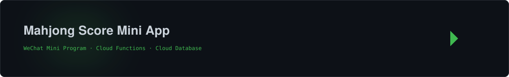
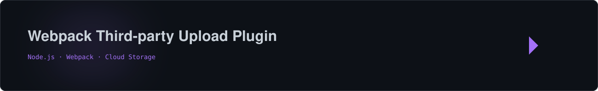

<a href="https://github.com/cduyzh"></a>

<b>关于我：高级 Web 前端开发工程师，长期关注现代 Web 应用、前端工程化、开发者工具与 AI 辅助软件开发。</b><br>
相比单纯完成页面开发，我更喜欢把一个想法真正做成产品：<br>
<b>需求分析 → 技术设计 → 开发 → 测试 → 部署 → 持续迭代</b><br>

<a href="https://github.com/cduyzh?tab=repositories"></a>
<a href="https://github.com/cduyzh?tab=followers"></a>


## 💻 代表项目 / Projects

<a href="https://github.com/cduyzh/hsr-endgame-archive-cn"></a>

<b>《崩坏：星穹铁道》终局竞速档案与数据分析平台。</b><br>
用于收录和展示终局竞速记录，提供复杂条件筛选、环境统计、投稿审核、游戏数据同步与 Serverless API 等完整能力。

<a href="https://github.com/cduyzh/hsr-endgame-archive-cn"></a>

<br><br>

<a href="https://github.com/cduyzh/mahjong-score-miniapp"></a>

<b>面向线下牌局场景的微信小程序实时记分工具。</b><br>
支持多人实时同步记分、撤销、历史牌局查询以及自动生成积分结算方案。

<a href="https://github.com/cduyzh/mahjong-score-miniapp"></a>

<br><br>

<a href="https://github.com/cduyzh/webpack-plugin-thirdparty-upload"></a>

<b>用于 Web 构建产物自动发布的 Webpack 插件。</b><br>
支持将构建产物自动上传至第三方对象存储，并结合 CDN 等服务完成自动化发布流程。

<a href="https://github.com/cduyzh/webpack-plugin-thirdparty-upload"></a>


## 🛠 技术栈 / Tech Stack

```text
前端: TypeScript · JavaScript · Vue · React
工程化: Vite · Webpack · pnpm · Git
服务端: Node.js · Serverless Functions · PostgreSQL
平台: 微信小程序 · Netlify · Docker
AI: ChatGPT · Codex · AI-assisted Development
```


## 🧠 AI × 软件工程 / AI Native

我正在尝试建立一种新的开发模式：**开发者负责目标、判断与决策，AI 参与分析、实现、检查与执行。**

```ts
const currentFocus = {
  building: 'AI 驱动的 Web 产品',
  exploring: 'AI Native 软件工程',
  improving: '开发流程与工程自动化',
  shipping: '真正有人使用的小产品',
}
```

希望逐步把 AI 从 **代码补全工具** 变成 **软件工程协作者**。


<div align="center">
  
  
</div>

<a href="https://github.com/cduyzh"></a>
