<b>关于我：高级 Web 前端开发工程师，长期关注现代 Web 应用、前端工程化、开发者工具与 AI 辅助软件开发。</b> 
相比单纯完成页面开发，我更喜欢把一个想法真正做成产品： 
<b>需求分析 → 技术设计 → 开发 → 测试 → 部署 → 持续迭代</b> 

## 💻 代表项目 / Projects

欢迎访问我的个人网站 [https://www.cduyzh.top/](https://www.cduyzh.top/) 获取以下已上线项目：

- [**星穹铁道竞速档案站｜终局配队与低金通关攻略**](https://www.cduyzh.top/)：收录《崩坏：星穹铁道》各类终局玩法的真实通关记录，支持复杂条件筛选与实战视频查找。
- [**崩坏：星穹铁道 · 终局血量膨胀趋势可视化**](https://www.cduyzh.top/)：汇总历期怪物血量数据，通过交互式趋势图直观展示游戏数值膨胀情况与难度变化。
- [**月来信**](https://www.cduyzh.top/)：专注隐私的经期规律记录与伴侣关怀提醒工具，以温和克制的设计守护身心节奏。
- [**成都区级降雨与精细网格气象**](https://www.cduyzh.top/)：聚焦成都超局地降水，汇聚雷达反射率与短时临近预报，提供精细化的降水时间轴推演。
- [**未发售游戏前瞻与发售日聚合**](https://www.cduyzh.top/)：追踪全球新游发售日更迭与平台排期，建立结构清晰的发售倒计时与期待度前瞻时间轴。
- [**GPT Image 提示词工作库**](https://www.cduyzh.top/)：模块化的生成式图像提示词资产库，支持积木式拼装光影与艺术风格。
- [**星铁强敌弱点与战斗机制速查**](https://www.cduyzh.top/)：高难度关卡首领属性弱点、韧性值与核心应对策略的高效率资料速查工具。
- [**人物立绘与角色卡片自动化工作流**](https://www.cduyzh.top/)：基于轻量 AI 工作流，将人物设定自动拆解并产出高一致性的角色卡片排版。
- [**AI 大模型 SVG 动画能力大比拼：熊猫骑行实验室**](https://www.cduyzh.top/)：实测并对比主流 AI 大模型生成 SVG 动画的实际表现效果。

  
  

